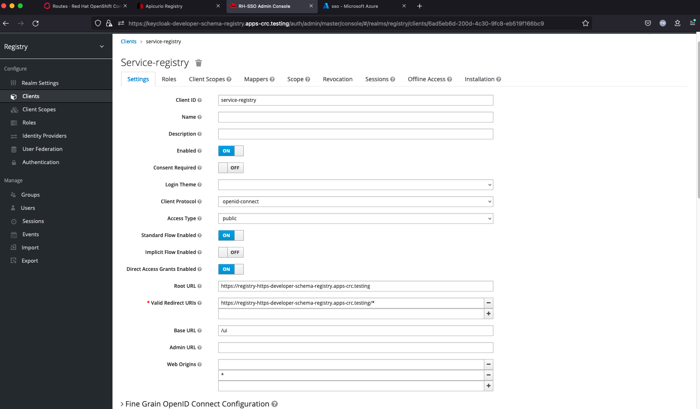
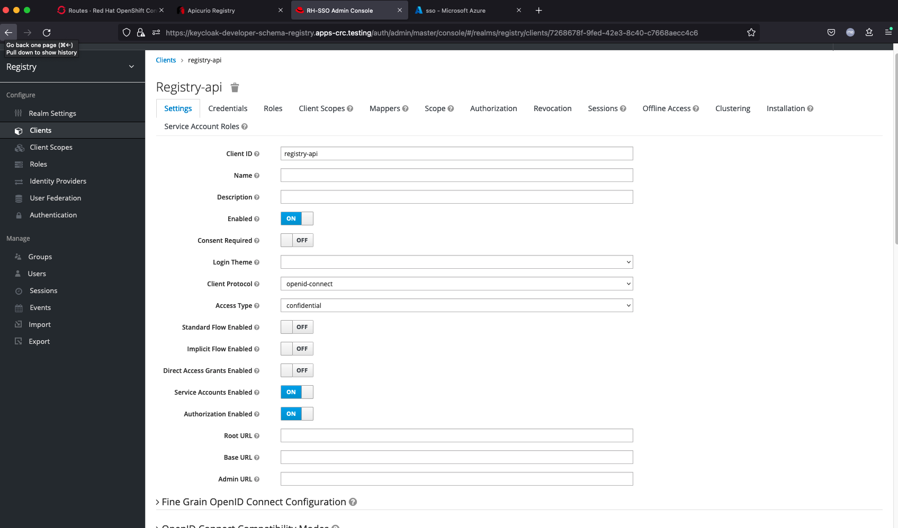
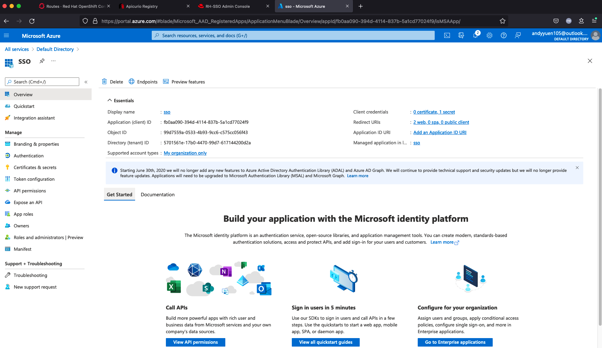
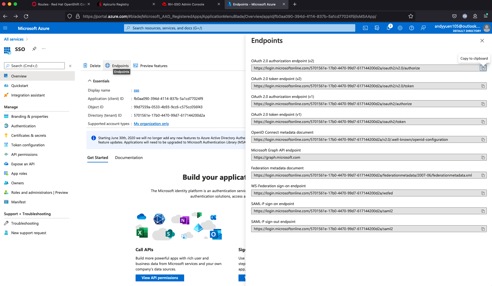
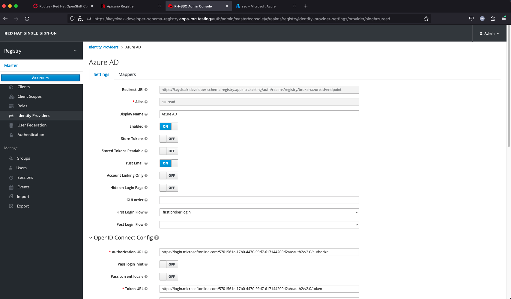
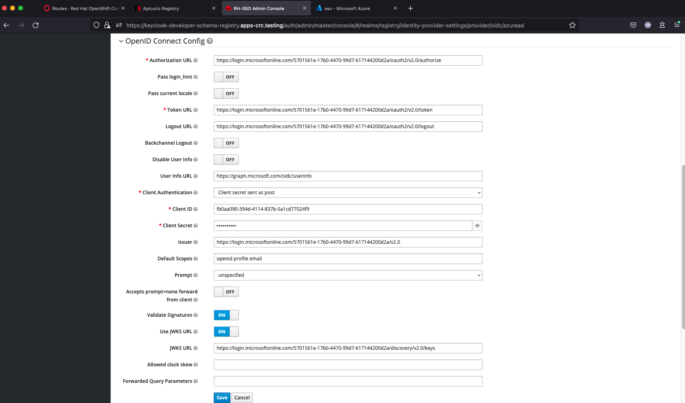
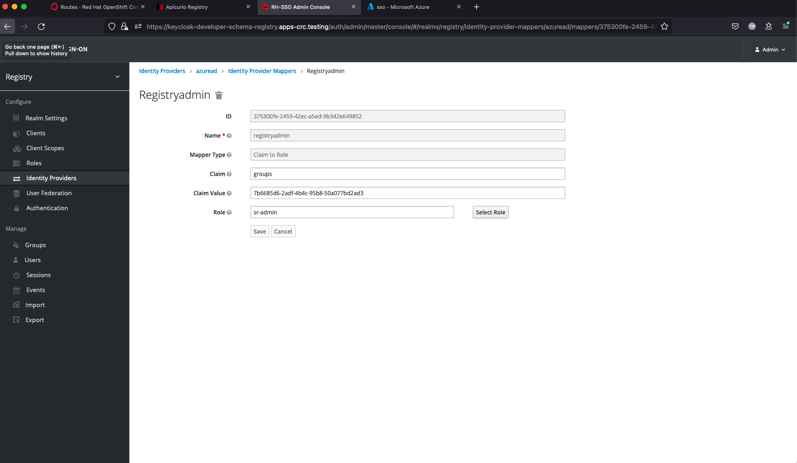
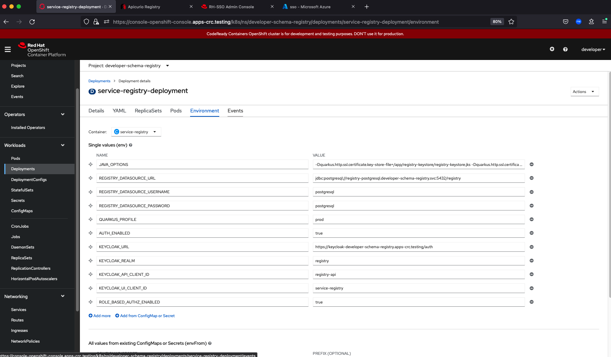
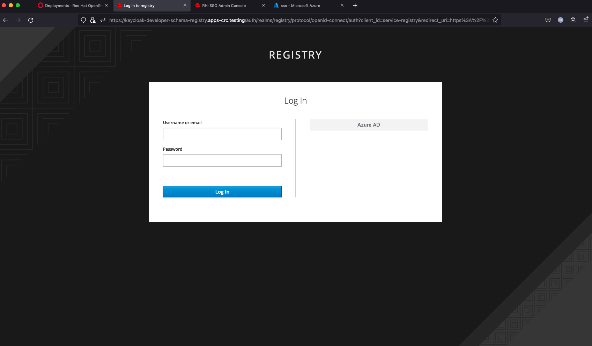

# Securing the Apicurio Service Registry UI and API

A registry is a runtime system (server) that stores a specific set of artifacts (files). It provides the ability to add, update, and remove the artifacts from the store, using either the UI or a REST API. It can also use global rules to ensure that content validity and compatibility level are enforced when updating an artifact

Common artifacts include: 
OpenAPI, AsyncAPI, GraphQL, Apache Avro, Google protocol buffers, JSON Schema, Kafka Connect schema, WSDL, XML Schema (XSD)

## 1 Why this videos?
The objectives for making these videos include:
* Rectifying the scarcity of documentation and programming examples on the Apicurio Service Registry when security is involved
* Illustrating how Red Hat Single Sign-On (RHSSO) can be used as an identity and access management tool
* Showing how we can use Azure AD as the IdP for RHSSO 
* Demonstrating how the Apicurio Service Registry can be used as a drop-in replacement for Confluent’s Schema Registry
* Writing Quarkus applications that use Apicurio Service Registry as a schema registry to validate produced messages

   
I posted two videos on Youtube titled:  
Securing the Apicurio Service Registry UI
and API Part 1 and Part 2

You can watch Part 1 here:

 
Part 1 is on securing the registry user interface which includes:
* A demo
* Configuring RHSSO as both Service Provider(SP) and Identity Provider(IdP) 
* Configuring RHSSO as SP and Azure AD as IdP
* Configuring the Registry to use HTTPS and SSO for authentication/authorisation

 
And Part 2 here:

 
Part 2 is on securing the registry REST API which includes:
* A demo
* Configuring a RHSSO client service account for accessing the registry API

And writing Quarkus Producer and Consumer apps. This involves:
* A demo
* Using the SSO client service account for authentication and authorisation
* Using an Avro schema
* Generating code for the schema and including the code in the build path
* Auto-registering the schema in the registry if not already registered
* Using schema registry to validate data produced
 

My environment for the demo includes:

* OpenShift 4.7.18 (Codeready Containers)
* Red Hat Integration - AMQ Streams Operator  2.0.0
* Red Hat Single Sign-On Operator 7.4.9
* Red Hat Integration - Service Registry Operator 2.0.4

  
## 2 Setting up the demo
Please note that the yaml files in the 'deployment' directory serve only as a starting point to configure your environment. You may have to change some of them before they will work for you. Cases for change include but not limited to:
* You want to run all components in a project other then "service-registry"
* Change the subdomain base name to match your host
* URLs for SSO
* Keystore and truststore content or location
* Service registry deployment environment variables (you can change them in the 'deployment->Environment' from the OpensShift console)
  
### 2.1 Setting up the environment
Install Codeready Containers and the named Operators. Create an OpenShift project called 'service-registry'.
  
### 2.2 Setting up RHSSO/Azure AD
Install RHSSO using the Single Sign-On Operator. Log in using an OpenShift admin account and run the oc commands:
<pre>
oc project service-registry
oc create -f keycloak.yaml
</pre>

After setting up an SSO instance, you have to configure a realm (registry), roles (sr-admin, sr-developer and sr-readonly), users, 2 clients (service-registry and registry-api) and an identity provider (Azure AD) as shown in the Part 1 video. 
  
SSO Service Registry Client settings:

  
SSO Service API Client settings:

  

The identity provider setup requires a matching setup using the Azure Portal to configure groups, users and an app registration as shown in video 1.
  
Azure App Registration Screen:

  
Azure App Registration Endpoints:

  
SSO Identity Provider settings:

  
SSO Identity Provider settings (continued):

  
SSO Identity Provider Mapper:

  
### 2.3 Setting up Apicurio Service Registry
I started out using the Service Registry Operator to set up my registry. I have to modify the deployment to include a volume mount to access the keystore and truststore configured in a secret. These changes are required because I need to use HTTPS for Azure AD intgration. Unfortunatley, modifying the deployment created by the Opeartor does not work as the Operator will revert it back to the original momentarily. I have to create an independent deployment not controlled by the Operator to do the job. This means that the Service Registry Operator is not being used in my setup.

Install the Apicurio Service Registry as follows (assuming you have already created the 'service-registry' OpenShift project):
<pre>
oc project service-registry
oc create secret generic registry-keystore \
  --from-file=/yourPath/yourKeystoreName.jks \
  --from-file=/yourPath/yourTruststoreName.jks --type=opaque
oc create -f /yourPath/registry-postgresql-deployment.yaml
oc create -f /yourPath/service-registry-deployment.yaml
</pre>
where /yourPath/yourKeystoreName.jks and /yourPath/yourTruststoreName.jks are your keystore for trustsore for your registry respectively. Both keystore and trustsore have password 'changeit'. If you set a different password, you have to change the JAVA_OPTIONS  below to match.
The registry can use either a PostgreSQL database, Kafka (Red Hat AMQ Streams), or Infinispan (Red Hat Data Grid) for persitence. I am using PostgreSQL.
  
See this [article](https://www.ibm.com/docs/en/imdm/11.6?topic=security-creating-ssl-artifacts) on how to create a keystore and a truststore. See Section 2.4 on how to get the ca certifacate for keycloak. You then import the certificate into your truststore using 'keytool'.
  
Registry deployment environment variables:

  
The value for JAVA_OPTIONS is:
<pre>
-Dquarkus.http.ssl.certificate.key-store-file=/app/registry-keystore/registry-keystore.jks
-Dquarkus.http.ssl.certificate.key-store-file-type=jks 
-Dquarkus.http.ssl.certificate.key-store-password=changeit 
-Dapicurio.registry.request.ssl.truststore.location=/app/registry-keystore/cacerts.jks
-Dapicurio.registry.request.ssl.truststore.type=jks
-Dapicurio.registry.request.ssl.truststore.password=changeit  
</pre>

These options set up the registry's keystore and the truststore location and oasswords. The volume mount is defined in the deployment to access the secret 'registry-keystore' conatining the keystore and truststore.
  
After completing the setup of RHSSO/Azure AD/Apicurio Service Registry, you will see a new 'Azure AD' button in the login screen when you point you browser to the registry's route:

Clicking on it will redirect you to the Azure login page.
  
### 2.4 Setting up a Kafka cluster
Install the AMQ Streams Operator and run the following command as an OpenShift admin user.
<pre>
oc project service-registry

export KEYCLOAK_HOST=keycloak-service-registry.apps-crc.testing
echo "" | openssl s_client -servername $KEYCLOAK_HOST \
 -connect $KEYCLOAK_HOST:443 -prexit 2>/dev/null| openssl x509 -outform PEM > /tmp/keycloak.crt

# create secret in project where kafka cluster is installed (for me the project is kafka)
oc create secret generic ca-keycloak  --from-file=/tmp/keycloak.crt

oc create -f my-cluster.yaml
</pre>
where KEYCLOAK_HOST is the route exposed by keycloak without 'https://'. We create a truststore secret called 'ca-keycloak' such that the Kafka can call the keycloak services without getting an SunCertPathBuilderException: unable to find valid certification path to requested target.

Please note that you may need to change the keycloak URLs and the kafka host and bootstrap addresses in the yaml.
  
### 2.5 Running the Quarkus Kafka producer and consumer apps
These apps run on the local machine instead of on OpenShift like the other components such as Kafka, SSO, registry. This is deliberate as I wanted to show what a developer will do: testing everything on the local machine. I also wanted you to know that kafka applications running outside of OpenShift can use the Kafka Bootstrap Host without any special configuration.
 

The apps pick up the required parameters from the system environment as config parameters (see the application.properties files). The parameters are defined as env variables:
<pre>
export KEYCLOAK_HOST=https://keycloak-developer-schema-registry.apps-crc.testing
export KEYCLOAK_REALM=registry
export KEYCLOAK_CLIENT_ID=registry-api
export KEYCLOAK_CLIENT_SECRET=yourSecret
export SSL_TRUSTSTORE_PATH=/path/truststore.jks
export SSL_TRUSTSTORE_PASSWORD=changeit
export KAFKA_TOPIC=new-topic
export KAFKA_BOOTSTRAP_URL=https://my-cluster-kafka-bootstrap-service-registry.apps-crc.testing:443
export REGISTRY_URL=https://registry-https-service-registry.apps-crc.testing/api

# for producer only
mvn clean generate-sources

# for both producer and consumer
mvn package
java -jar target/quarkus-app/quarkus-run.jar
</pre>
They should be self-explanatory. Change as required to run in your environment. 
  
Although the demo has little to show on the surface, it packs a lot of features behind the scenes. The interesting part is that these features are set up using configuration instead of writing code. They include:
* Using a SSO client service account to authenticate/authorise before sending/receiving messages using the Kafka cluster and accessing the service registry. 
This is done using the Simple Authentication and Security Layer (SASL) OAUTHBEARER mechanism, ​​OAuth 2.0 bearer tokens (RFC 6750) for authorisation and JAAS/OIDC for login (authentication).
* The apps automatically refresh the bearer token when required.
* The apps use the Arvo schema: SimpleMessage.avsc. Avro uses JSON for defining data types and protocols, and serialises data in a compact binary format. The build process uses maven plugins to generate code based on the schema and includes the generated code in the build path. The generated code, for this simple schema, is the SimpleMessage Java class which facilitates message serialisation.
* With the schema registry in place, the producer, before sending the data to Kafka, talks to the schema registry first and checks if the schema is available. If it doesn’t find the schema, it registers the schema and caches it in the schema registry. Then, the producer serialises the data and sends it to Kafka in binary format prepended with the unique schema ID. 
* When the consumer processes this message, it communicates with the schema registry using the schema ID it got from the message header and deserialises the message using the same schema. If there is a schema mismatch, the schema registry will throw an error letting the app know that the schema agreement has been broken.

  
And that's it folks

